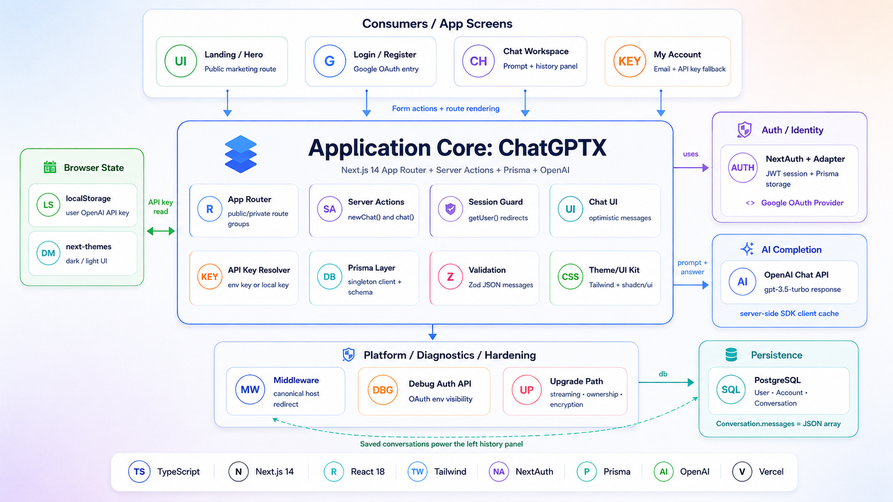
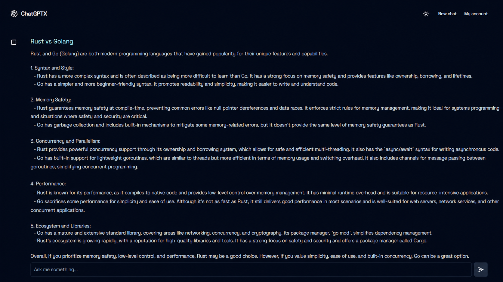
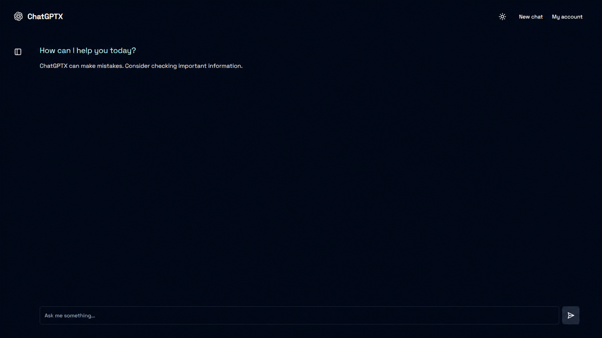
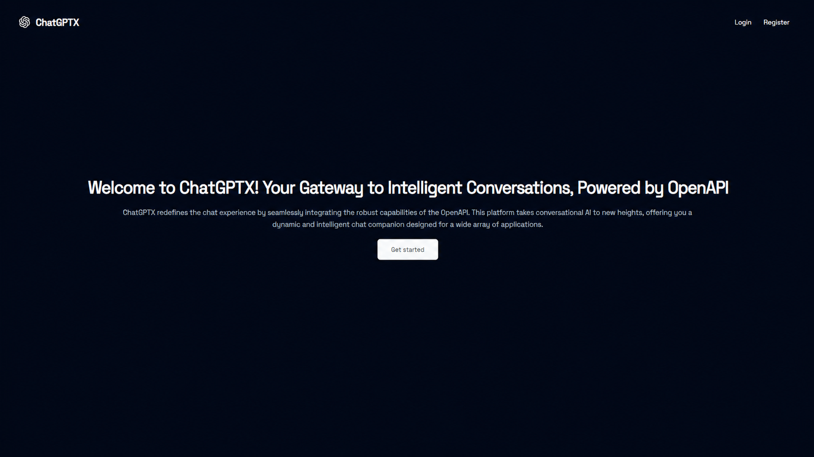
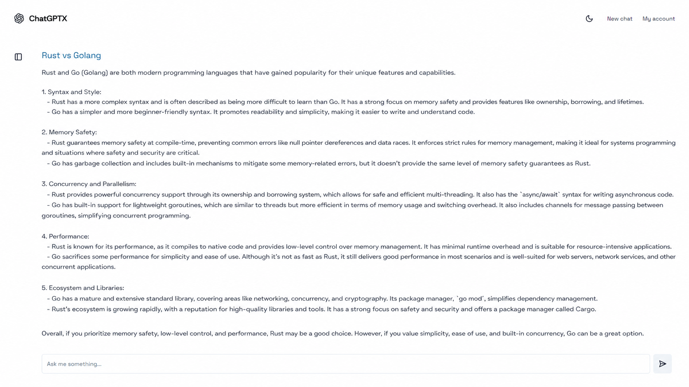

# ChatGPTX

ChatGPTX is a clean, full stack AI chat application built with Next.js. It includes Google login, saved conversations, dark/light mode, a responsive chat UI, and OpenAI powered answers using the user's own API key or a server side environment key.

## Preview











## Features

- Google authentication with NextAuth
- AI chat powered by the OpenAI API
- OpenAI API key support through Vercel environment variables
- Optional user-provided OpenAI API key saved in the browser
- Saved chat conversations with Prisma and PostgreSQL
- Conversation history panel
- New chat flow with optimistic UI updates
- Dark and light theme support
- Responsive, minimal interface built with Tailwind CSS and shadcn/ui components

## Tech Stack

| Category | Technology |
| --- | --- |
| Framework | Next.js 14 |
| Programming Language | TypeScript |
| Frontend Library | React 18 |
| Styling | Tailwind CSS |
| UI Components | shadcn/ui, Radix UI |
| Authentication | NextAuth.js |
| OAuth Provider | Google OAuth |
| Database | PostgreSQL |
| ORM | Prisma |
| AI Integration | OpenAI API |
| Icons | Lucide React |
| Validation | Zod |
| Theme Support | next-themes |
| Deployment | Vercel |
| Linting | ESLint |
| Package Manager | npm |

## Project Structure

```text
ChatGPTX/
├── actions/
│   └── chat.ts
├── app/
│   ├── (private-layout)/
│   │   ├── chat/
│   │   │   ├── [id]/
│   │   │   │   ├── chat.tsx
│   │   │   │   ├── loading.tsx
│   │   │   │   └── page.tsx
│   │   │   ├── input.tsx
│   │   │   ├── layout.tsx
│   │   │   └── page.tsx
│   │   └── layout.tsx
│   ├── (public-layout)/
│   │   ├── (auth)/
│   │   │   ├── login/
│   │   │   │   └── page.tsx
│   │   │   └── register/
│   │   │       └── page.tsx
│   │   ├── (hero)/
│   │   │   └── page.tsx
│   │   └── layout.tsx
│   ├── api/
│   │   ├── auth/
│   │   │   └── [...nextauth]/
│   │   │       └── route.ts
│   │   └── debug-auth/
│   │       └── route.ts
│   ├── error.tsx
│   ├── favicon.ico
│   ├── globals.css
│   ├── layout.tsx
│   └── not-found.tsx
├── components/
│   ├── ui/
│   │   ├── button.tsx
│   │   ├── dialog.tsx
│   │   ├── input.tsx
│   │   ├── label.tsx
│   │   ├── scroll-area.tsx
│   │   ├── sheet.tsx
│   │   ├── skeleton.tsx
│   │   ├── toast.tsx
│   │   ├── toaster.tsx
│   │   └── use-toast.ts
│   ├── google-login.tsx
│   ├── hero-nav.tsx
│   ├── left-panel.tsx
│   ├── logo.tsx
│   ├── navbar.tsx
│   ├── profile.tsx
│   ├── session-provider.tsx
│   ├── signout-btn.tsx
│   ├── submit.tsx
│   ├── theme-provider.tsx
│   ├── toggle.tsx
│   └── user-api.tsx
├── images/
│   ├── preview-1.png
│   ├── preview-2.png
│   ├── preview-3.png
│   └── preview-4.png
│   └── preview-5.png
├── lib/
│   ├── auth.ts
│   ├── bootstrap-env.ts
│   ├── env.ts
│   └── utils.ts
├── prisma/
│   ├── client.ts
│   └── schema.prisma
├── types/
│   └── index.ts
├── .env.example
├── .eslintrc.json
├── .gitignore
├── components.json
├── LICENSE
├── middleware.ts
├── next.config.mjs
├── package-lock.json
├── package.json
├── postcss.config.js
├── README.md
├── tailwind.config.ts
└── tsconfig.json
```

## Getting Started

### 1. Install dependencies

```bash
npm install
```

### 2. Create your environment file

```bash
cp .env.example .env
```

Fill in the required values:

```env
POSTGRES_PRISMA_URL=
POSTGRES_URL_NON_POOLING=
NEXTAUTH_SECRET=
GOOGLE_ID=
GOOGLE_SECRET=
OPENAI_API_KEY=
NEXTAUTH_URL=http://localhost:3000
```

### 3. Set up the database

```bash
npx prisma generate
npx prisma db push
```

### 4. Run the development server

```bash
npm run dev
```

Open `http://localhost:3000` in your browser.

## Usage

1. Register or log in with Google.
2. Add `OPENAI_API_KEY` to your environment, or go to **My account** and enter a user-specific key.
3. Start a new chat and ask a question.
4. Previous conversations will appear in the conversation panel.

## Vercel Setup

Add this environment variable in Vercel before deploying:

```env
OPENAI_API_KEY=your_openai_api_key
```

Set it for Production, Preview, and Development if you want all deployments to use the same server-side key. For `NEXTAUTH_URL`, put only the URL in the Vercel value field, for example `https://chat-gptx-sigma.vercel.app`, not `NEXTAUTH_URL=https://chat-gptx-sigma.vercel.app`. The app redirects Vercel deployment URLs back to this canonical URL before Google sign-in, so Google OAuth does not break on every redeploy. After saving environment variables, redeploy the project so the app can read the new values.

## Available Scripts

```bash
npm run dev      
npm run build    
npm run start    
npm run lint     
```

## Environment Variables

| Variable | Description |
|---|---|
| `POSTGRES_PRISMA_URL` | PostgreSQL database connection URL used by Prisma |
| `POSTGRES_URL_NON_POOLING` | Direct PostgreSQL connection URL for Prisma |
| `NEXTAUTH_SECRET` | Secret key used by NextAuth |
| `GOOGLE_ID` | Google OAuth client ID |
| `GOOGLE_SECRET` | Google OAuth client secret |
| `OPENAI_API_KEY` | Server-side OpenAI API key used when the account key field is empty |
| `NEXTAUTH_URL` | Base URL of the app, such as `http://localhost:3000` |

For Google OAuth, the authorized redirect URI must be `${NEXTAUTH_URL}/api/auth/callback/google`. For the production deployment above, add `https://chat-gptx-sigma.vercel.app/api/auth/callback/google` to the Google Cloud OAuth client.

## Notes

- The app uses `OPENAI_API_KEY` from the server environment when the account key field is empty.
- A user can still enter an OpenAI API key inside the app to override the server environment key for their session.
- Conversations are stored in PostgreSQL through Prisma.
- The default chat model in the source code is `gpt-3.5-turbo`; you can update it in `actions/chat.ts`.
